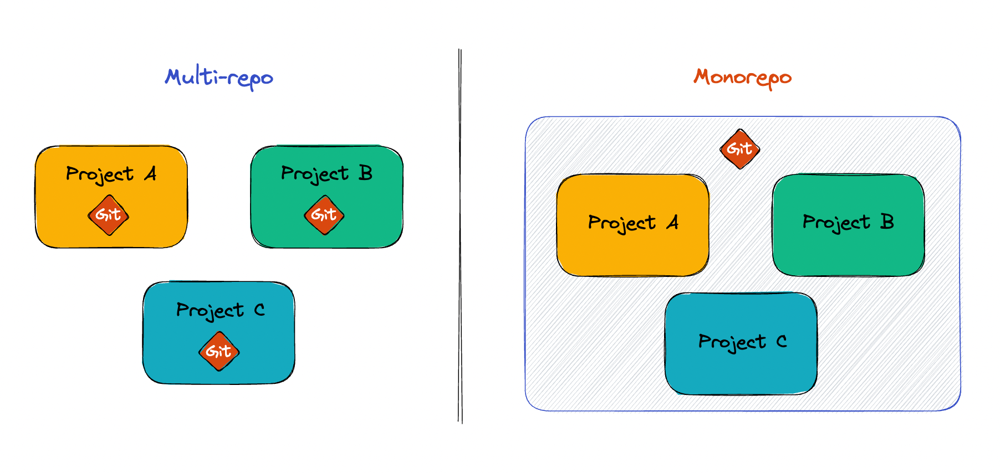

# 모노레포(Monorepo)와 멀티레포(Multi-repo)

모노레포란 여러 개의 프로젝트를 하나의 저장소에서 관리하는 소프트웨어 개발 방법론이다. 모노레포에서는 여러 프로젝트들이 하나의 코드 베이스에서 함께 개발되고, 이를 통해 코드 공유와 재사용성을 강화하여 개발 생산성을 높이는 것이 목적이다.

 

## 멀티레포(Multi-repo)
먼저 멀티레포에 대해 간략하게 설명할 필요가 있겠다. 멀티레포는 각각의 프로젝트를 별도의 저장소(Repository)로 관리하는 방법이다. 각각의 저장소는 서로 다른 코드 베이스를 가지고 있으며, 독립적으로 개발이 이루어지고 릴리즈 된다.   
장점과 단점은 아래와 같다.

### 장점
- 각 저장소는 서로 독립적으로 개발이 가능하기 때문에 개발자들이 서로 영향을 주지 않고 빠르게 개발할 수 있다.
- 각 저장소는 독립적으로 빌드되기 때문에, 전체 빌드 시간이 줄어든다.
- 코드 변경 사항에 대한 테스트와 배포가 간편하다.

### 단점
- 다른 저장소에서 작성한 코드에 의존성이 있을 경우, 관리가 어렵다.
- 각 저장소에서 사용하는 라이브러리 버전을 일치시키는 것이 어렵다.
- 전체 시스템의 일관성을 유지하기 위해, 각 저장소에서 적절한 코드리뷰와 협업이 필요하다.

 

## 모노레포(Monorepo)
그래서, 멀티레포 방식에서 발생하는 문제점들을 해결하기 위해 모노레포 방식이 등장하게 되었다.   
위에서 언급한 것처럼 모노레포란 여러 개의 프로젝트를 하나의 저장소에서 관리하는 소프트웨어 개발 방법론이다. 조사한 바에 의하면 구글이나 페이스북과 같은 대규모 기업에서 도입하여 사용한다고 한다. 이들은 코드 베이스의 일관성을 유지하고 개발자들 간의 협업을 촉진하기 위해 모노레포를 사용하고 있다.   
마찬가지로 장단점은 아래와 같다.   

### 장점
- 하나의 저장소에서 모든 코드를 관리하기 때문에, 코드의 일관성을 유지하기 쉽다.
- 각각의 코드 변경사항이 시스템 전체에 미치는 영향을 쉽게 파악할 수 있다.
- 코드 재사용이 쉽고, 코드 간의 의존성 관리를 쉽게 할 수 있다.

### 단점
- 저장소의 크기가 커질수록 전체 빌드 시간이나 배포 시간이 길어질 수 있다.
- 코드 변경에 대한 테스트와 배포가 복잡해질 수 있다.
- 저장소의 크기와 빌드 시간이 커질 수 있기 때문에, 코드 변경 충돌이 발생할 수 있다. 이러한 문제를 해결하기 위해서는 적극적인 코드리뷰와 협업이 필요하다.

 

## 그래서 어떤 걸 선택해야 되나?
뭐가 더 좋고, 더 나쁘고 그런 것은 당연히 없다. 각각의 장단점은 분명 존재하기 때문이다.   
현재 본인의 개발팀의 프로젝트 크기나 성격, 팀 내 협업 방식 등을 고려하여 적절한 작업 방식을 선택하고, 이를 최적화 하는데 더 노력해야 한다.

 

함께 읽은 글
- [팀워크 향상을 위한 모노레포(Monorepo) 시스템 구축](https://blog.mathpresso.com/%ED%8C%80%EC%9B%8C%ED%81%AC-%ED%96%A5%EC%83%81%EC%9D%84-%EC%9C%84%ED%95%9C-%EB%AA%A8%EB%85%B8%EB%A0%88%ED%8F%AC-monorepo-%EC%8B%9C%EC%8A%A4%ED%85%9C-%EA%B5%AC%EC%B6%95-3ae1b0112f1b)
- [Turborepo로 모노레포 개발 경험 향상하기](https://engineering.linecorp.com/ko/blog/monorepo-with-turborepo/)
- [Mono vs Multi Repos - Pick Your Poison](https://www.raftt.io/post/development-challenges-of-working-with-monorepos-and-multirepos)
- [모던 프론트엔드 프로젝트 구성 기법 - 모노레포 개념 편](https://d2.naver.com/helloworld/0923884)
