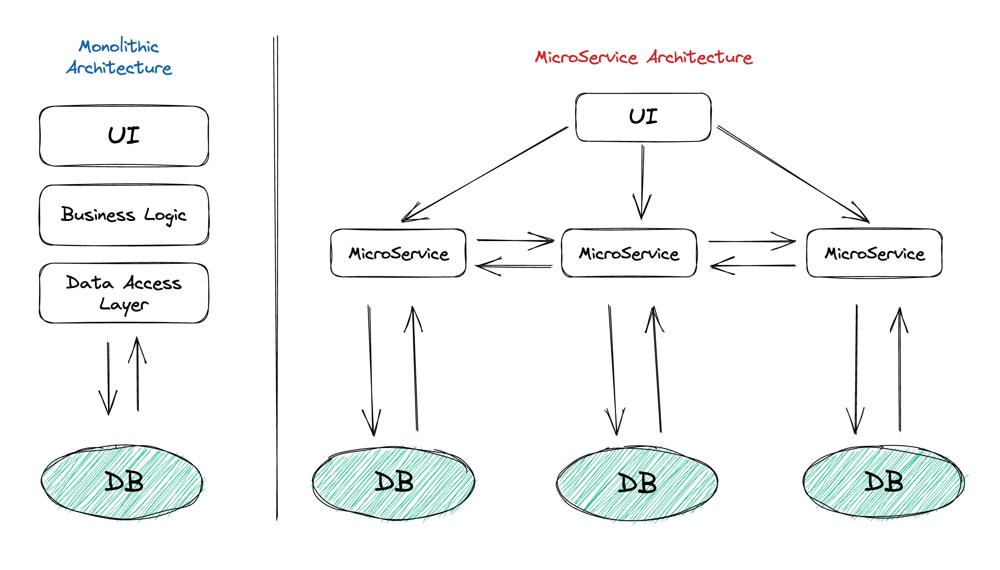

# MSA와 BFF에 대한 개념(Feat. Monolithic Architecture)

## Monolithic Architecture
MSA를 말하기 앞서 MSA와 상반되는 개념인 Monolithic Architecture(모놀리식 아키텍처)에 대해 설명할 필요가 있다. 모놀리식 아키텍처는 소프트웨어를 하나의 큰 모듈로 구성하는 아키텍처 패턴이다.   
모든 기능을 하나의 애플리케이션 안에 구현하며, 데이터 베이스, UI, 비즈니스 로직 등 모든 구성 요소가 하나의 코드 베이스 안에 존재한다.   

 

모놀리식 아키텍처는 초기에는 간단하게 개발할 수 있어 개발자들에게 인기가 있었으나, 애플리케이션의 크기와 복잡도가 증가함에 따라 아래와 같은 단점을 가지게 되었다.

- 확장성: 모놀리식 아키텍처는 하나의 큰 모듈로 구성되기 때문에 확장하기 어렵다. 새로운 기능을 추가하거나 서버의 부하를 분산시키는 것이 어렵기 때문에 확장성이 낮다.
- 유지보수: 모놀리식 아키텍처는 모든 코드가 하나의 코드 베이스에 존재하기 때문에 유지보수가 어렵다. 큰 코드 베이스에서 버그를 찾는 것은 어렵기 때문이다.
- 배포: 애플리케이션 전체를 배포해야하기 때문에 배포 시간이 오래 걸린다. 또한, 하나의 모듈에 대한 변경 사항이 전체 애플리케이션에 영향을 미친다.
- 기술 스택: 모놀리식 아키텍처는 하나의 애플리케이션에서 모든 기능을 구현하기 때문에 서로 다른 기술 스택을 사용하기 어렵다. 하나의 코드 베이스에서 모든 컴포넌트를 처리하기 때문에 기술 스택을 변경하거나 업그레이드하기가 까다롭다.

위와 같은 한계가 존재했고 대규모 애플리케이션에서는 MSA를 사용하는 경향이 생기기 시작했다.

## MSA(MicroService Architecture)
MSA는 소프트웨어를 작은 서비스들로 분리하고 각각의 서비스들이 독립적으로 실행될 수 있도록 설계하는 아키텍처 패턴이다.   
각각의 서비스들은 특정 기능을 수행하며, 다른 서비스들과 통신하여 전체 시스템을 완성한다.   
이러한 아키텍처를 적용하면, 개발자들은 서비스들을 독립적으로 개발하고 배포할 수 있어 개발과 유지보수에 용이하다.   

 

 

하지만 MSA에도 단점은 존재한다.
- 복잡성: MSA는 각각의 서비스가 독립적으로 동작하기 때문에 여러 서비스가 필요한 경우 전체 시스템의 복잡성이 증가할 수 있다. 이는 서비스 간의 통신, 데이터 일관성 유지, 배포 등의 문제로 이어질 수 있다.
- 분산 시스템 관리: MSA는 분산 시스템이기 때문에 관리를 위한 적절한 도구와 기술이 필요하다. 서비스 배포, 모니터링, 로깅, 장애 대응 등에 대한 추가적인 비용이 필요할 수 있다.
- 데이터 일관성 유지: 각각의 서비스가 독립적으로 동작하므로, 데이터 일관성을 유지하는 것이 중요하다.
- 테스트와 디버깅: 분리된 서비스로 인해 서비스 간의 통신, 데이터 일관성 등을 검증하는 테스트와 디버깅이 어려울 수 있다. 이를 위해 적절한 테스트, 디버깅 도구 및 방법을 사용해야 한다.
- 초기 개발 비용: 초기 개발 비용이 많이 들 수 있다. 각각의 서비스를 독립적으로 개발하고, 서비스 간의 통신을 위한 인터페이스를 정의해야 하기 때문이다.

 

## BFF(Backend For Frontend)
Frontend를 위한 Backend. 클라이언트와 백엔드 서비스 간의 직접적인 통신이 아닌, 클라이언트를 위한 별도의 서버 레이어를 추가하는 방식으로 동작한다.   
BFF는 클라이언트와 백엔드 서비스 간의 인터페이스 역할을 수행하며, 클라이언트의 요구사항에 따라 필요한 데이터만 제공하고, 데이터를 가공하거나 변환하는 등의 역할을 수행한다. 이를 통해 클라이언트와 백엔드 서비스 간의 결합도를 낮출 수 있으며, 개발과 관리를 분리할 수 있다.

 

 

에를 들어, 모바일 애플리케이션에서는 특정 기능을 수행하기 위해 필요한 데이터를 REST API를 통해 백엔드 서비스에서 가져올 수 있다. 하지만 서로 다른 기능을 수행하는 여러 개의 클라이언트가 존재하는 경우, 백엔드 서비스는 각 클라이언트의 요구사항에 따라 데이터를 가공하거나 변환하는 작업을 수행해야 한다. 이러한 작업은 백엔드 서비스의 복잡성을 증가시키고 유지보수를 어렵게 만들 수 있다.   
이러한 문제를 해결하기 위해 BFF 패턴을 사용하면, 클라이언트마다 별도의 BFF 서버를 두어 클라이언트 요구사항에 맞게 데이터를 가공하거나 변환할 수 있다. 이를 통해 백엔드 서비스는 단순히 데이터만 제공하면 되므로, 개발과 관리가 용이해지며 클라이언트와 백엔드 서비스 간의 결합도를 낮출 수 있다.
